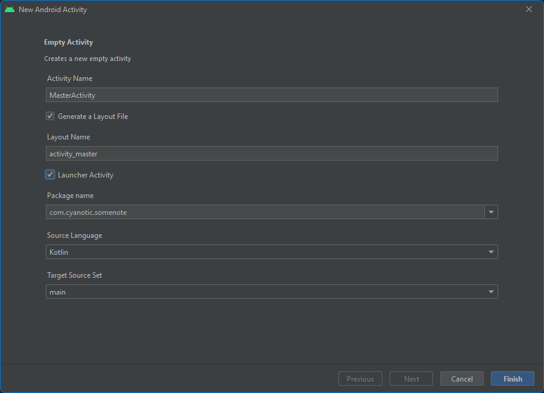
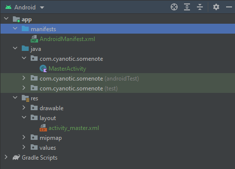
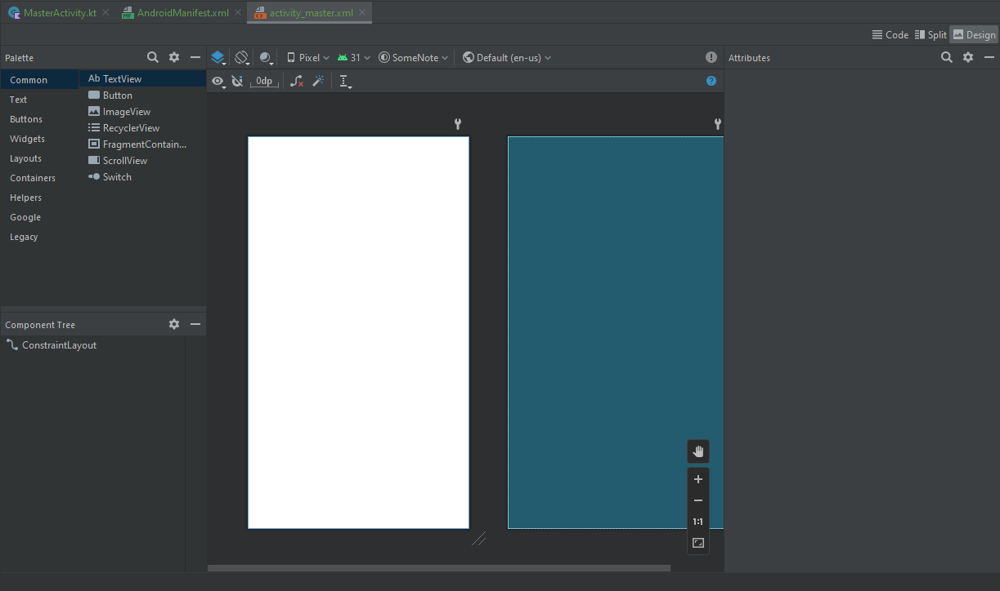

# La prima Activity
Al momento il progetto consiste in un'app vuota, senza alcuna schermata.
La prima cosa che dovrai fare, quindi, sarà creare la tua prima schermata. Su Android una "pagina" o "schermata" si 
chiama _Activity_.

Per crearne una nuova ti basta cliccare su _File_ -> _New_ -> _Activity_ -> _Empty Activity_.

Come al solito partiamo con dei componenti basilari, ma Android Studio ti mette già a disposizione parecchi template tra
cui scegliere. Mi raccomando, non seguire troppo pedissequamente questa guida. Qualcuno avrebbe detto:

> Stay hungry, stay foolish

quindi, sentiti libero di esplorare e smanacciare tra diverse opzioni, così da prendere confidenza con l'IDE.



Sentiti libero di cambiare l'_Activity Name_ in quello che ti piace di più. In questo caso io ho scelto di chiamarla 
_Master Activity_. Assicurati di aver abilitato l'opzione _Launcher Activity_ e clicca su _Finish_.

## Cosa ha fatto Android Studio per te?
Android Studio ha automaticamente fatto un po' di roba per te. Andiamo insieme ad analizzare quali sono queste 
operazioni che avresti potuto fare anche tu a mano. L'ordine non è importante.



### Creazione di una nuova Activity class
Nella cartella `App` -> `Java` -> `com.cyanotic.somenote` (il tuo package potrebbe essere diverso) è stato aggiunto un
nuovo file chiamato `MasterActivity`. Facendo doppio click puoi vedere il contenuto del file nell file editor.

```kotlin
package com.cyanotic.somenote

import androidx.appcompat.app.AppCompatActivity
import android.os.Bundle

class MasterActivity : AppCompatActivity() {
    override fun onCreate(savedInstanceState: Bundle?) {
        super.onCreate(savedInstanceState)
        setContentView(R.layout.activity_master)
    }
}
```

Andiamo a ispezionare il file riga per riga.

```kotlin
package com.cyanotic.somenote

import androidx.appcompat.app.AppCompatActivity
import android.os.Bundle
```
Queste righe contengono nient'altro che package directives e imports. In sostanza stiamo dicendo al compilatore a quale
package appartiene la classe e di quali classi hai bisogno per compilare questa classe.
Per maggiori informazioni su Kotlin e packages, ti rimando alla
[guida ufficiale kotlin](https://kotlinlang.org/docs/packages.html).

```kotlin
class MasterActivity : AppCompatActivity()
```
Questa riga è molto importante. Stai dicendo che questa classe _estende_ la classe base `Activity`. In questo caso
specifico Android Studio ha deciso di estendere `AppCompatActivity` per garantire retrocompatibilità con vecchie
versioni di Android (copriremo questo argomento più in avanti).

```kotlin
override fun onCreate(savedInstanceState: Bundle?) { 
    super.onCreate(savedInstanceState)
    setContentView(R.layout.activity_master)
}
```
Qui stai facendo l'_override_ del metodo `onCreate` dell'`AppCompatActivity` e invocando la funzione base utilizzando
la keyword `super`. Nel caso in cui dimentichi di chiamare `super.onCreate`, l'IDE ti darà un errore e, se provi a
lanciare l'app, otterrai un crash a runtime (prova tu stesso!).

Subito dopo l'inizializzazione dell'activity, viene invocato 
[setContentView](https://developer.android.com/reference/android/app/Activity#setContentView(int)) 
che serve a dire ad Android quale sia il layout associato allo schermo. Tramite questa funzione diciamo ad Android di
_instanziare_ il layout, in altre parole stiamo utilizzando un XML per generare un albero di classi UI (Views). 
La trasformazione da XML a oggetti java viene chiamata _Layout Inflation_.

Da notare che, non appena aggiungiamo un file XML nella cartella `res/layout`, il compilatore genera un identificativo
univoco (`Int`) chiamato `R.layout.nome_layout` che possiamo utilizzare in funzioni come `setContentView`.

Vedremo questo pattern molto di frequente in lezioni successive: lo stesso approccio viene utilizzato per identificare
 qualsiasi risorsa aggiungeremo nella cartella `res` (strings, drawables, dimensions, ...).

### Aggiunta della nuova activity nell'AndroidManifest.xml

Nella cartella `App` -> `Manifests` puoi trovare il file `AndroidManifest.xml`.

Questo file contiene molte informazioni sull'app:
- Permessi
- Servizi
- Activities
- Broadcast Receivers
- ...

Come al solito, non voglio soffermarmi troppo sulla composizione dell'Android Manifest e ti rimando alla
[guida ufficiale Android](https://developer.android.com/guide/topics/manifest/manifest-intro) se vuoi saperne di più da 
subito.

La parte che importante è questa:
```xml
<activity
    android:name=".MasterActivity"
    android:exported="true">
    <intent-filter>
        <action android:name="android.intent.action.MAIN" />
        <category android:name="android.intent.category.LAUNCHER" />
    </intent-filter>
</activity>
```

Android Studio ha definito un nuovo oggetto chiamato `Activity`, come proprietà ha:
- `android:name`: il nome della classe associato all'Activity (che andremo a vedere nel prossimo paragrafo). 
Invece di utilizzare `.MasterActiviy` puoi anche utilizzare il nome del package completo 
`com.cyanotic.somenote.MasterActivity`. È totalmente indifferente;
- `android:exported="true"`: che dice al sistema operativo che questa schermata può essere lanciata da altre app; 
Su Android anche il launcher (per capirci meglio, il desktop) è un'app, quindi è necessario dichiarare questa proprietà
a `true`! A riprova di questa affermazione, puoi andre sul Play Store e scaricare un launcher completamente differente 
da quello incorporato nel tuo telefono!

```xml
<intent-filter>
    <action android:name="android.intent.action.MAIN" />
    <category android:name="android.intent.category.LAUNCHER" />
</intent-filter>
```
Queste due righe servono a dire ad Android che questa è l'_entrypoint_ della tua app, cioè che questa è la 
schermata principale della tua app. Dato che l'`intent-filter` può essere dichiarato per ogni Activity, puoi avere diverse icone sul tuo launcher per la
stessa app che aprono diverse schermate!

**PROTIP:** questa impostazione è utilissima per creare una schermata di debug dell'app dove puoi abilitare o 
disabilitare certe funzionalità o cambiare dei parametri della tua app. ;) Un esempio classico è cambiare lo URL del server del tuo backend da remoto a locale, nel caso tu voglia far girare il
server sul tuo computer durante lo sviluppo dell'app!

### Creazione di un nuovo layout
Nella cartella `App` -> `res` -> `layout` troverai un file XML che descrive la struttura della tua schermata (layout).

Prova ad aprire il file e, invece di visualizzarne il sorgente, ti verra' mostrato un rettangolo vuoto.


Questo è il Layout Editor di Android Studio. La figura bianca è come lo schermo apparirà a runtime, mentre quella verde
è chiamato "Blueprint" che ti permette di capire dove vengono posizionati i componenti e quanto spazio occuperanno. 

In alto a destra trovi 3 controlli:
- Design: quello appena selezionato che ti offre un editor drag n drop;
- Split: che ti permette di vedere sia l'XML che una preview della schermata;
- Code: che ti permette di vedere solo l'XML della tua schermata;

Prova a utilizzare le tre differenti modalità e a capire come funzionano.

Personalmente non conosco nessuno che utilizzi la modalità _Design_ perchè davvero troppo poco accurata.

Per questo motivo, dalla prossima lezione lavoreremo sempre con l'XML.

## Riassumendo
Per creare un'Activity hai bisogno di:
- Creare una nuova classe;
- Aggiungere la classe all'`AndroidManifest.xml` e, opzionalmente, aggiungerla al launcher tramite `intent-filter`;
- Creare un layout di cui fare _Inflating_;

Complimenti! Adesso puoi creare un nuovo emulatore, lanciare la tua app e avrai una magnifica schermata bianca!

[Git Repo](https://github.com/Otacon/Practical-Kotlin/tree/main/1.3-Activity)

[Prossimo: Hello World](1.4_hello_world.md)

[Precedente: Il primo progetto](1.2_first_project.md)

[Torna all'indice](index_of_content.md)