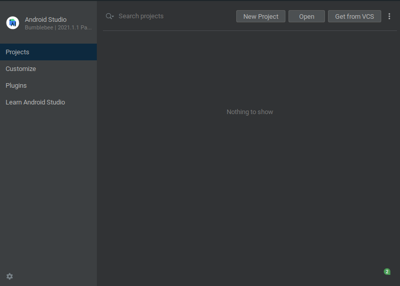
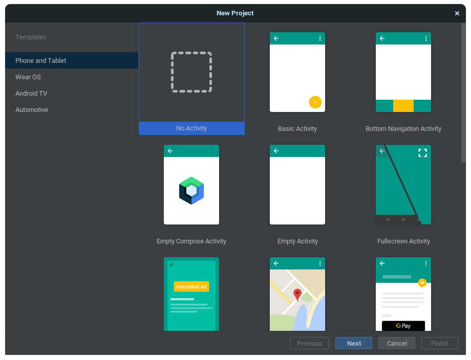
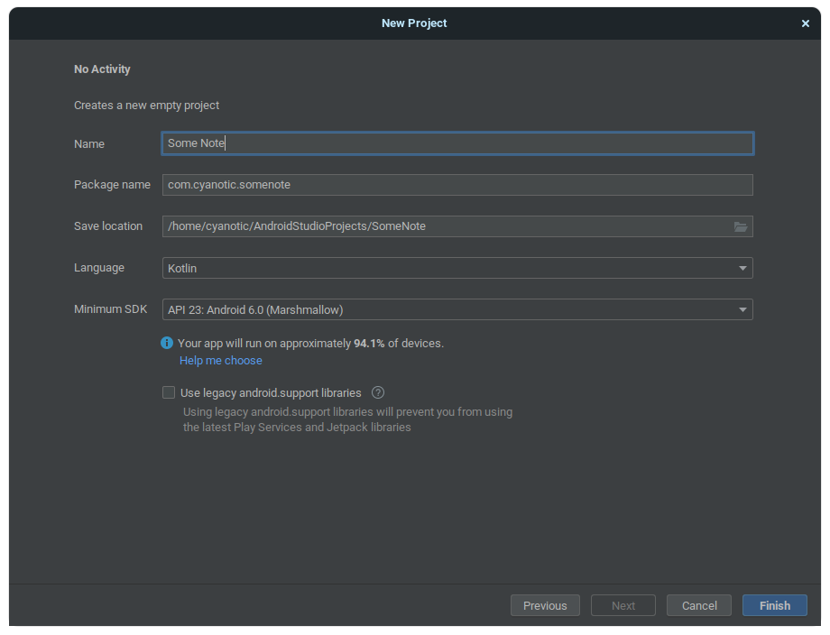
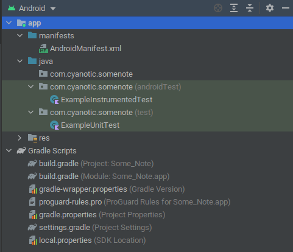

# Il primo progetto

Appena aperto l'IDE ti ritroverai con una lista (al momento vuota) di progetti.

Da qui puoi aprire un progetto esistente o crearne uno nuovo. Clicca su <em>New Project</em>.

Questa schermata ti permette di creare dei progetti basati su dei template già inizializzati da Google. Divertiti 
a esplorarli tutti per capire cosa contengono. Per adesso vai nella sezione _Phone and Tablet_, scegli il progetto 
_No Activity_ e clicca su _Next_.

Qui puoi dare libero sfogo alla tua fantasia e scegliere il nome e package della tua app. 

Data la mia spiccata fantasia ;) , ho chiamato la mia App *SomeNote*.

_Minimum SDK_ è la minima versione di Android che vuoi supportare. Al momento non è molto importante, ma ti consiglio di 
selezionare qualcosa superiore o uguale a 6.0.

E questa è la struttura del nostro progetto vuoto. Ci sono un sacco di cartelle, files, colori, dei sorgenti già 
inizializzati \[...\]. Potrei descriverti ogni singolo file cosa fa in questo blog post ma non lo farò: questo è 
*Practical* Android: ti spiegherò come funziona tutto, solo a tempo debito ;)

Prossimo: Hello World Activity

[Torna all'indice](index.md)